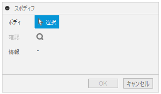
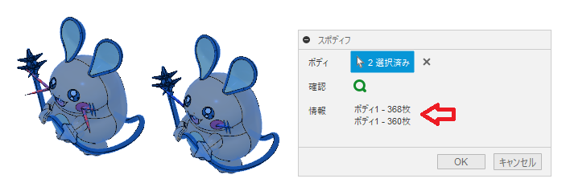

# Fusion360_SpoDiff
3D間違い探しのお手伝い

---

## **インストール**:
インストールする際は、zip ファイルをダウンロード/展開後 "SpoDiff" フォルダを **アドイン** として登録してください。

アドインの登録は、[こちら](https://kantoku.hatenablog.com/entry/2021/02/15/161734)の手順に従ってください。

---

## **使用法** :

アドイン起動後は、"検査"  内に "スポディフ" コマンドが追加されます。

クリックする事でダイアログが表示されます。

二つのボディを選択します。少し時間がかかりますが、情報欄に選択したボディの違いの情報を表示します。

OKボタンを押す事で、異なる面のみを抜き出します。

先に選択したボディのみの面は赤色、二番目に選択したボディのみの面は青色で抜き出します。

+ 各ボディの所属している原点との位置関係で違いの比較を行っています。

---

## **ライセンス**:
- MIT

---

## **謝辞** :

- [日本語フォーラム](https://forums.autodesk.com/t5/fusion-360-ri-ben-yu/bd-p/707)の皆さん、ありがとう。